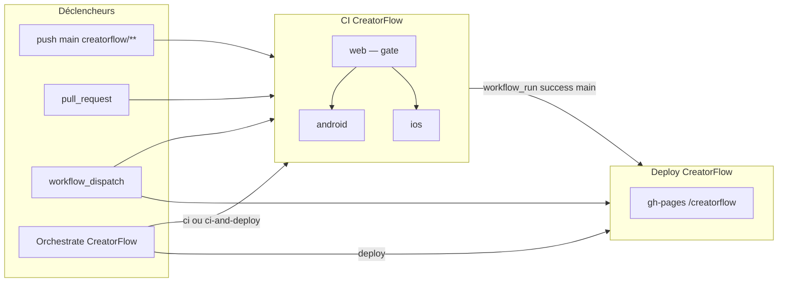

# GitHub Actions — orchestration CreatorFlow

Ce dépôt sépare **validation (CI)**, **déploiement** et **pilotage manuel** pour CreatorFlow. Les workflows `android-play-release` (META / Google Play) et `api-ci` restent indépendants.

## Vue d’ensemble



| Workflow | Rôle | Déclencheurs |
|----------|------|--------------|
| **CI CreatorFlow** | Gate qualité (web → android/ios) | `push` / `pull_request` sur `creatorflow/**`, `workflow_dispatch` |
| **Deploy CreatorFlow** | Publication GitHub Pages | `workflow_run` après succès CI sur `main`, `workflow_dispatch` |
| **Orchestrate CreatorFlow** | Control plane manuel | `workflow_dispatch` uniquement |
| **API CI** | Backend API | Inchangé (`api/**`, `supabase/**`) |
| **Build Android release** | META → Google Play | Inchangé (`google-app/**`, etc.) |

## CI CreatorFlow — gate web

Le job `web` exécute typecheck, tests unitaires, build et e2e Playwright. Les jobs `android` et `ios` ne démarrent qu’après succès de `web` (`needs: web`).

- **push** sur `main` (paths `creatorflow/**`) : CI complète ; en cas de succès sur `main`, le déploiement est enchaîné automatiquement.
- **pull_request** : CI sans déploiement (les PR ne déclenchent pas `Deploy CreatorFlow`).
- **workflow_dispatch** : relance manuelle de la CI (utile pour valider une branche ou après un incident).

## Deploy CreatorFlow — après CI

Le déploiement **n’est plus déclenché par un `push` direct** sur `creatorflow/**`.

Il part lorsque :

1. **CI CreatorFlow** se termine avec succès sur `main` (`workflow_run`, hors PR), ou
2. un **`workflow_dispatch`** manuel sur **Deploy CreatorFlow**.

Le checkout utilise le SHA du run CI (`workflow_run.head_sha`) pour publier exactement le commit validé.

## Orchestrate CreatorFlow — control plane

Workflow manuel : **Actions → Orchestrate CreatorFlow → Run workflow**.

| Option `pipeline` | Comportement |
|-------------------|--------------|
| `ci` | Lance uniquement **CI CreatorFlow** sur le `ref` choisi |
| `deploy` | Lance uniquement **Deploy CreatorFlow** (sans repasser par la CI) |
| `ci-and-deploy` | Lance la CI ; le déploiement suit automatiquement si la CI réussit sur `main` |

Paramètre `ref` : branche, tag ou SHA (défaut `main`).

## Parcours typiques

### Merge sur `main` (CreatorFlow)

1. `push` → **CI CreatorFlow** (`web` puis `android` / `ios`)
2. Succès sur `main` → **Deploy CreatorFlow** via `workflow_run`
3. Site live : https://carllaliberte.github.io/contract/creatorflow/

### Pull request

1. **CI CreatorFlow** sur la branche de la PR
2. Pas de déploiement tant que la PR n’est pas mergée

### Déploiement d’urgence ou re-publish

- **Deploy seul** : Orchestrate → `deploy`, ou **Deploy CreatorFlow** → Run workflow
- **Re-valider puis déployer** : Orchestrate → `ci-and-deploy` sur `main`

## Fichiers concernés

```
.github/workflows/
  ci-creatorflow.yml      # CI + gate web
  deploy-creatorflow.yml  # Pages, après CI
  orchestrate.yml         # Control plane manuel
  api-ci.yml              # (inchangé)
  android-play-release.yml # (inchangé)
```

## Notes

- Les commits de déploiement sur `gh-pages` utilisent `[skip ci]` pour éviter des boucles.
- `ios` reste en `continue-on-error: true` : un échec simulateur n’empêche pas la CI globale ni le déploiement web.
- Pour l’API ou le dashboard META / Play Store, utiliser les workflows dédiés (`api-ci`, `android-play-release`, `deploy-meta-dashboard`).
